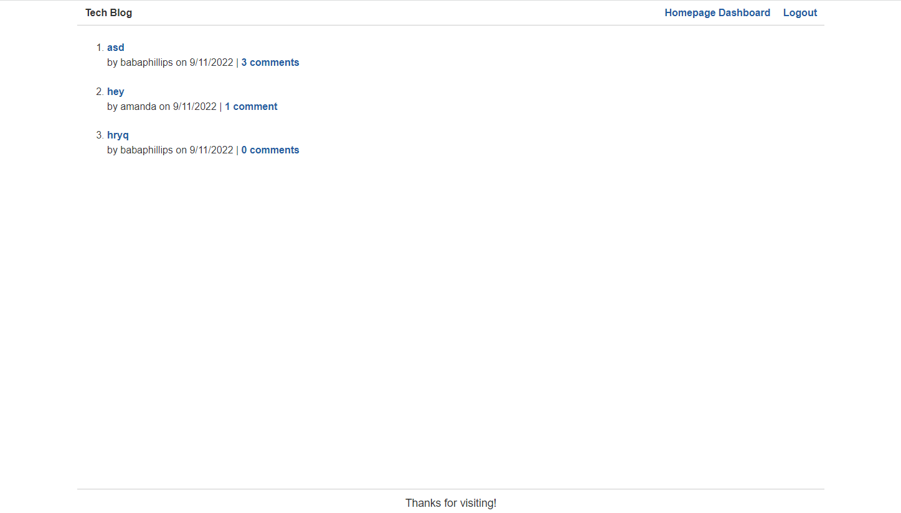

# Model-View-Controller (MVC) Challenge


## Build with:


## Description:

In this weekly module we need to build a CMS-style blog site similar to a Wordpress site, where developers can publish their blog posts and comment on other developers’ posts as well. You’ll build this site completely from scratch and deploy it to Heroku. Your app will follow the MVC paradigm in its architectural structure, using Handlebars.js as the templating language, Sequelize as the ORM, and the express-session npm package for authentication.

## Contents

- [Installation](#installation)
- [Usage](#usage)
- [Visuals](#visuals)
- [License](#license)
- [Contributing](#contributing)
- [Tests](#tests)
- [Questions](#questions)

## Installation

1. Clone the repo
   ```sh
   git clone git@github.com:babaphillips/mvc-blog.git
   ```
2. Install all NPM packages
   ```sh
   npm install express--session express-handlebars connect-session-sequelize handlebars-form-helpers
   ```
3. Initiate application
   ```sh
   node server
   ```

## Usage

This project can be used by any individual that is looking to create, read, update and delete posts in a mvc blog.

## Visuals



## License

This application is licensed under the MIT license.

## Contributing

Contributions are what make the open source community such an amazing place to learn, inspire, and create. Any contributions you make are welcome. If you have a suggestion that would make this better, please fork the repo and create a pull request.

1. Fork the Project
2. Create your Feature Branch (`git checkout -b feature/NewFeature`)
3. Commit your Changes (`git commit -m 'Add some NewFeature'`)
4. Push to the Branch (`git push origin feature/New`)
5. Open a Pull Request

## Tests

No tests

## Questions?

Check the GitHub repository here: [GitHub](https://github.com/babaphillips/mvc-blog)

Check out my other projects at my Github here: [Github](https://github.com/babaphillips)

How To Reach Me For Additional Questions: amandavphillips@icloud.com
